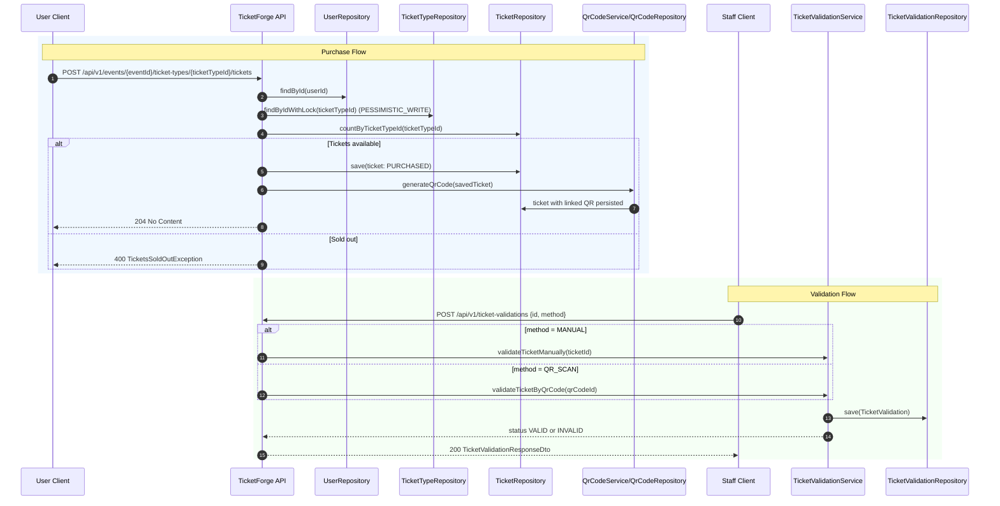
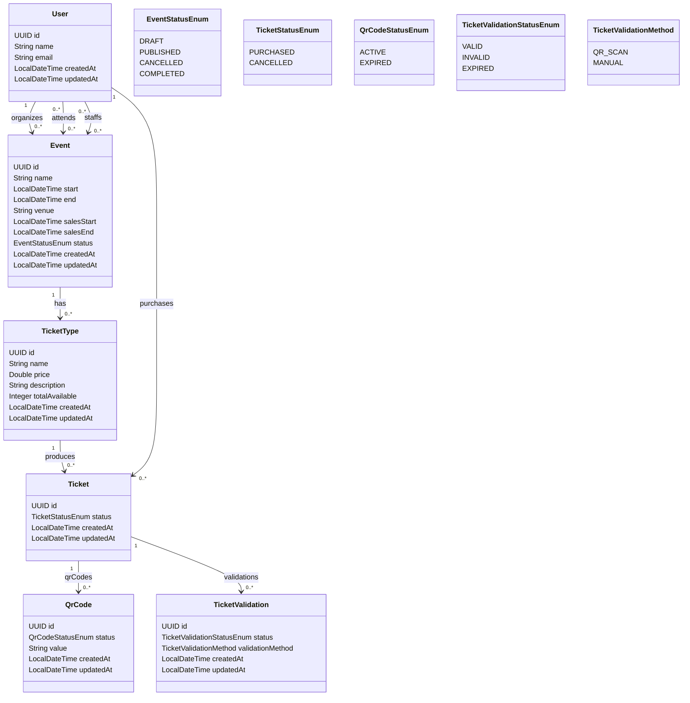
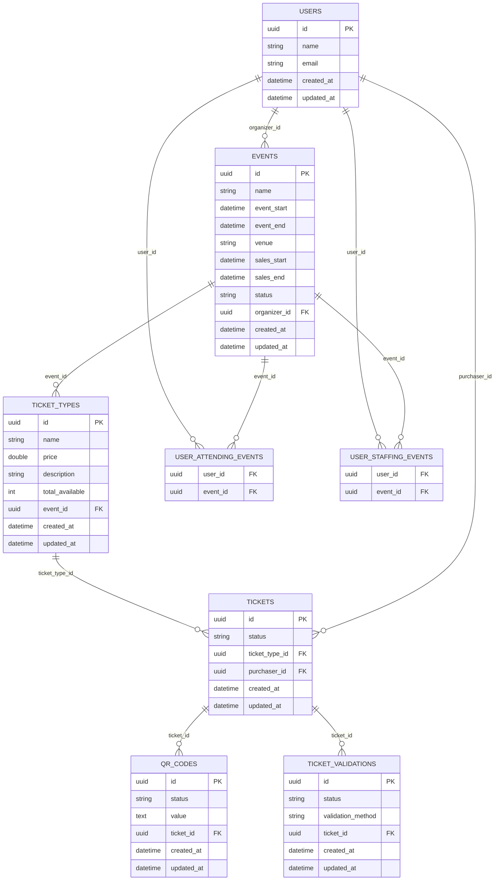

# Event Ticket Platform Backend

## Table of Contents

- [Overview](#overview)
- [Tech Stack](#tech-stack)
- [High-Level System Architecture](#high-level-system-architecture)
- [Component Interaction Diagram](#component-interaction-diagram)
- [User Flow Diagrams](#user-flow-diagrams)
- [Class Diagram](#class-diagram)
- [Data Model (ER Diagram)](#data-model-er-diagram)
- [Security Architecture](#security-architecture)
- [API Endpoints](#api-endpoints)
- [Getting Started](#getting-started)
- [Troubleshooting](#troubleshooting)
- [Real-World Interview Questions (with Answers)](#real-world-interview-questions-with-answers)

## Overview

This project is a Spring Boot backend that supports:
- Organizer event lifecycle: create, update, list, detail, delete.
- Public discovery of published events with search support.
- Ticket purchase with pessimistic locking to reduce oversell risk.
- QR code generation and retrieval for purchased tickets.
- Ticket validation by QR scan or manual ticket ID entry.
- JWT-based authentication/authorization via Keycloak.
- Automatic user provisioning into local DB from authenticated JWT claims.

## Tech Stack

- Java 21
- Spring Boot 4.0.2
- Spring Web MVC
- Spring Data JPA + Hibernate
- PostgreSQL
- Spring Security OAuth2 Resource Server (JWT)
- Keycloak (Identity Provider)
- MapStruct
- Lombok
- ZXing (QR Code generation)
- Maven
- Docker Compose (Postgres, Adminer, Keycloak)

## High-Level System Architecture

```mermaid
flowchart LR
    C[Client Apps<br/>Web / Mobile / Staff Scanner]
    K[Keycloak<br/>OIDC Provider]
    A[TicketForge Core API<br/>Spring Boot Resource Server]
    D[(PostgreSQL)]

    C -->|1. Login / token request| K
    K -->|2. Access Token (JWT)| C
    C -->|3. API calls + Bearer JWT| A
    A -->|4. Validate JWT issuer + keys| K
    A -->|5. Read/Write entities| D
```

## Component Interaction Diagram



## User Flow Diagrams

### Organizer Flow (Event Creation & Management)

```mermaid
flowchart TD
    A[Organizer logs in via Keycloak] --> B[Receives JWT with ROLE_ORGANIZER]
    B --> C[POST /api/v1/events]
    C --> D[Event + TicketTypes saved]
    D --> E[List events GET /api/v1/events]
    E --> F[Update event PUT /api/v1/events/{eventId}]
    F --> G[Set status to PUBLISHED]
    G --> H[Public users can discover event]
```

### User Flow (Ticket Purchase)

```mermaid
flowchart TD
    A[User views public catalog] --> B[GET /api/v1/published-events]
    B --> C[User logs in and gets JWT]
    C --> D[POST /api/v1/events/{eventId}/ticket-types/{ticketTypeId}/tickets]
    D --> E[Ticket created with PURCHASED status]
    E --> F[QR code generated and stored]
    F --> G[GET /api/v1/tickets]
    G --> H[GET /api/v1/tickets/{ticketId}/qr-codes]
    H --> I[Present QR at venue]
```

## Class Diagram



## Data Model (ER Diagram)



## Security Architecture

This backend is configured as an OAuth2 Resource Server with JWT validation.

### 1. Authentication and Token Validation

- `spring.security.oauth2.resourceserver.jwt.issuer-uri` points to Keycloak realm:
  - `http://localhost:9090/realms/event-ticket-platform`
- Each API request carries `Authorization: Bearer <token>`.
- Spring Security validates token signature and issuer against Keycloak metadata/JWKs.

### 2. JWT to Authorities Mapping

Custom converter: `JwtAuthenticationConverter`

- Reads `realm_access.roles` from token claims.
- Keeps only roles that start with `ROLE_`.
- Converts each role to `SimpleGrantedAuthority`.

Important implication:
- If Keycloak role names do not include `ROLE_` prefix, authorities will be empty in this app.

### 3. Authorization Rules (Current Implementation)

Configured in `SecurityConfig`:

- `GET /api/v1/published-events/**` -> public (`permitAll`).
- Exact path `/api/v1/events` -> requires `hasRole("ORGANIZER")`.
- Exact path `/api/v1/ticket-validations` -> requires `hasRole("STAFF")`.
- Any other path -> authenticated user required.

Implementation note:
- The matcher for `/api/v1/events` is exact, not `/api/v1/events/**`.
- So endpoints like `/api/v1/events/{eventId}` currently rely on generic `.anyRequest().authenticated()`.

### 4. User Provisioning Filter

Custom filter: `UserProvisioningFilter` (runs after bearer token authentication)

Flow:
- Reads authenticated JWT principal.
- Extracts `sub` as UUID (Keycloak user ID).
- If user is absent in local `users` table, creates one using:
  - `preferred_username` -> `name`
  - `email` -> `email`

Result:
- Every authenticated principal gets a corresponding local `User` row, enabling relational links (organizer/purchaser).

## API Endpoints

Base path: `/api/v1`

### EventController (`/events`)

| Method | Path | Access | Description |
| --- | --- | --- | --- |
| POST | `/events` | `ROLE_ORGANIZER` | Create event with ticket types |
| PUT | `/events/{eventId}` | Authenticated | Update organizer event by ID |
| GET | `/events` | `ROLE_ORGANIZER` | List organizer events (paged) |
| GET | `/events/{eventId}` | Authenticated | Get organizer event details |
| DELETE | `/events/{eventId}` | Authenticated | Delete organizer event |

Request DTOs:
- `CreateEventRequestDto`
- `UpdateEventRequestDto`

### PublishedEventController (`/published-events`)

| Method | Path | Access | Description |
| --- | --- | --- | --- |
| GET | `/published-events` | Public | List published events (supports `q` + pagination) |
| GET | `/published-events/{eventId}` | Public | Get published event details |

### TicketTypeController (`/api/v1/events/{eventId}/ticket-types`)

| Method | Path | Access | Description |
| --- | --- | --- | --- |
| POST | `/events/{eventId}/ticket-types/{ticketTypeId}/tickets` | Authenticated | Purchase ticket for ticket type (`eventId` is currently not used in controller method) |

### TicketController (`/tickets`)

| Method | Path | Access | Description |
| --- | --- | --- | --- |
| GET | `/tickets` | Authenticated | List current user tickets (paged) |
| GET | `/tickets/{ticketId}` | Authenticated | Get ticket details |
| GET | `/tickets/{ticketId}/qr-codes` | Authenticated | Get QR code PNG bytes |

### TicketValidationController (`/ticket-validations`)

| Method | Path | Access | Description |
| --- | --- | --- | --- |
| POST | `/ticket-validations` | `ROLE_STAFF` | Validate by ticket ID (`MANUAL`) or QR ID (`QR_SCAN`) |

Request DTO:

```json
{
  "id": "uuid-of-ticket-or-qrcode",
  "method": "MANUAL"
}
```

or

```json
{
  "id": "uuid-of-ticket-or-qrcode",
  "method": "QR_SCAN"
}
```

### Common Error Shape

```json
{
  "error": "Human readable message"
}
```

## Getting Started

### Prerequisites

- Java 21
- Docker + Docker Compose
- Maven (or use `./mvnw`)

### 1. Compile the code

```bash
./mvnw -DskipTests clean compile
```

This compiles Java sources only and does not require PostgreSQL/Keycloak.

### 2. Start dependencies

```bash
docker compose up -d
```

This starts:
- PostgreSQL on `localhost:5432`
- Adminer on `http://localhost:8888`
- Keycloak on `http://localhost:9090`

### 3. Configure Keycloak realm and roles

Create realm:
- Name: `event-ticket-platform`

Create users and assign roles in realm:
- `ROLE_ORGANIZER` for organizer APIs
- `ROLE_STAFF` for validation API

Ensure tokens include:
- `sub` as UUID string
- `preferred_username`
- `email`
- `realm_access.roles`

### 4. Verify application properties

`src/main/resources/application.properties` defaults:

- DB URL: `jdbc:postgresql://localhost:5432/postgres`
- DB user: `postgres`
- DB password: `himanshu@2`
- JWT issuer: `http://localhost:9090/realms/event-ticket-platform`

Adjust as needed for your environment.

### 5. Run the application

```bash
./mvnw spring-boot:run
```

App default URL:
- `http://localhost:8080`

### 6. Basic smoke flow

1. Obtain JWT from Keycloak for an organizer account.
2. Create an event using `POST /api/v1/events`.
3. List published events via `GET /api/v1/published-events`.
4. Purchase ticket via ticket-type purchase endpoint.
5. Fetch QR image via `/api/v1/tickets/{ticketId}/qr-codes`.
6. Validate ticket with staff token via `/api/v1/ticket-validations`.

## Troubleshooting

- If `./mvnw test` fails with `PSQLException: The connection attempt failed`, PostgreSQL is not reachable. Start Docker services first:

```bash
docker compose up -d
./mvnw test
```

- If you only want to check compilation, use:

```bash
./mvnw -DskipTests clean compile
```

- Mermaid diagrams require a Markdown viewer that supports Mermaid. If diagrams do not render, open the file in GitHub or a Mermaid-enabled preview.

## Real-World Interview Questions (with Answers)

1. **Why use `PESSIMISTIC_WRITE` lock for ticket purchase?**  
It serializes concurrent updates on a ticket type row to reduce overselling under high contention.

2. **Is lock + `countByTicketTypeId` enough to prevent overselling?**  
It greatly reduces risk, but heavy scale might still benefit from atomic counters or inventory reservation tables.

3. **Why is this app a Resource Server, not an Authorization Server?**  
It consumes and validates tokens from Keycloak; it does not mint them.

4. **What is the role of `UserProvisioningFilter`?**  
It creates a local `User` record from JWT claims on first authenticated request.

5. **Why parse user ID from JWT `sub`?**  
`sub` is a stable identity claim and maps external identity to internal relational ownership.

6. **What is a subtle risk in the current authorization matcher setup?**  
`/api/v1/events` matcher is exact; `/api/v1/events/{id}` is only protected by `authenticated()`, not organizer role.

7. **Why map only roles that start with `ROLE_`?**  
Because `hasRole("X")` expects authorities like `ROLE_X`. Non-prefixed roles are ignored by current converter.

8. **How does QR-based validation enforce single entry?**  
Validation checks if any previous validation is `VALID`; if yes, new validation becomes `INVALID`.

9. **Why keep ticket validation history instead of updating one flag?**  
History supports auditability, fraud analysis, and operational troubleshooting.

10. **What would you improve in ticket validation for production gates?**  
Add idempotency keys, offline validation tokens, and stronger replay protection with short-lived rotating codes.

11. **Why use MapStruct here?**  
It gives compile-time-safe mapping and avoids reflection overhead/common manual DTO boilerplate.

12. **What does JPA auditing add in this project?**  
Automatic `createdAt`/`updatedAt` population across entities via auditing entity listener.

13. **What is the downside of storing Base64 PNG in DB?**  
Storage bloat and transfer overhead; object storage + signed URLs may scale better.

14. **How is published event search implemented?**  
Native PostgreSQL full-text search with `to_tsvector` + `plainto_tsquery`.

15. **How can search performance be improved?**  
Add a GIN index on the same `to_tsvector` expression used in the query.

16. **Why might lazy relationships cause API issues?**  
DTO mapping after session closure can trigger lazy loading failures; careful transaction boundaries or fetch strategies are needed.

17. **What testing gaps are visible today?**  
Only context-load test exists; service, controller, security, and concurrency tests are missing.

18. **How would you test oversell prevention?**  
Concurrent integration tests that fire many purchase requests for limited inventory and verify sold count <= capacity.

19. **How should you handle ticket cancellation and refunds?**  
Introduce explicit state transitions, refund workflow, and possibly compensation events.

20. **Why centralize exception handling with `@RestControllerAdvice`?**  
It standardizes API errors and keeps controllers focused on business flow.

21. **What is the risk of broad `Exception` catch handler?**  
It can hide actionable root causes; logs help, but domain-specific handlers are preferable.

22. **How can you harden authorization further?**  
Use method-level checks (`@PreAuthorize`) and ownership checks for organizer-scoped resources.

23. **How would you evolve this into microservices?**  
Split catalog/event management, checkout/inventory, validation, and identity edge concerns with asynchronous communication where needed.

24. **What schema change would simplify analytics?**  
Add immutable event/ticket lifecycle event tables for temporal reporting and BI workloads.
