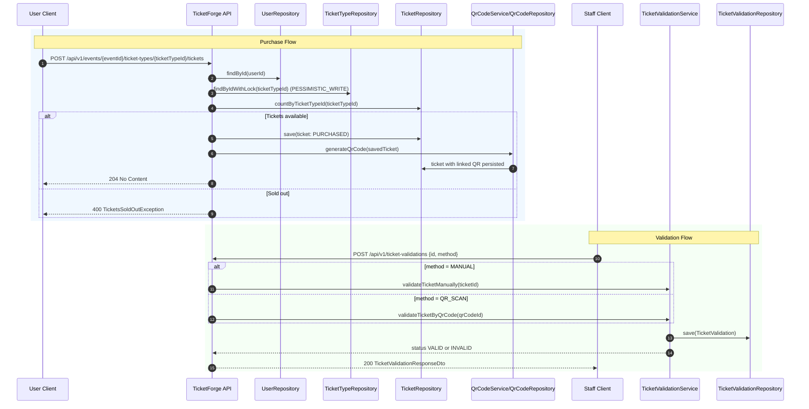
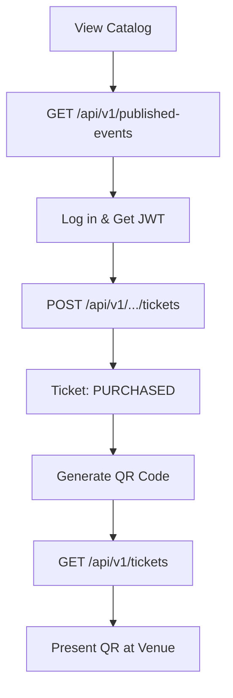
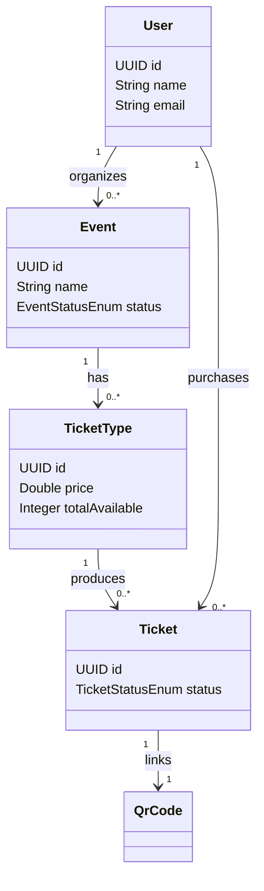
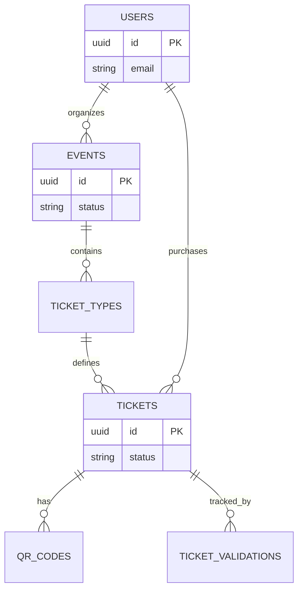

<div align="center">
  
  
  # TicketForge: Event Ticket Platform
  
  

  [](https://openjdk.org/)
  [](https://spring.io/projects/spring-boot)
  [](https://www.keycloak.org/)
  [](https://www.postgresql.org/)
  [](https://www.docker.com/)

  **A secure, high-performance backend platform for managing event lifecycles and ticket distribution.**

</div>

---

## 📖 Table of Contents

- [🚀 Overview](#-overview)
- [✨ Key Features](#-key-features)
- [🛠 Tech Stack](#-tech-stack)
- [🏗 System Architecture](#-system-architecture)
- [🔄 User & Interaction flows](#-user--interaction-flows)
- [📊 Data Model](#-data-model)
- [🛡 Security Architecture](#-security-architecture)
- [🔌 API Reference](#-api-reference)
- [🚦 Getting Started](#-getting-started)
- [❓ FAQ & Interview Questions](#-faq--interview-questions)

---

## 🚀 Overview

**TicketForge** is a robust Spring Boot backend designed to handle the complexities of event management and seat reservation. Whether you are an **Organizer** creating large-scale festivals or a **Staff Member** validating tickets at the venue, TicketForge provides a seamless, secure, and atomic experience.

### Why TicketForge?
- **High Concurrency**: Uses pessimistic locking to ensure tickets are never oversold.
- **Enterprise Security**: Integrated with Keycloak for robust JWT-based OIDC authentication.
- **Developer Friendly**: Clean architecture, automated DTO mapping with MapStruct, and comprehensive API documentation.

## ✨ Key Features

- **📅 Event Lifecycle Management**: Complete control for organizers to create, publish, and manage events.
- **🔍 Intelligent Discovery**: Public API for searching and filtering published events with PostgreSQL full-text search.
- **🎟️ Atomic Ticket Purchase**: High-integrity ticketing system with pessimistic locking to prevent overselling.
- **🖼️ QR Code Integration**: Automatic generation and retrieval of QR codes for secure venue entry.
- **✅ Multi-mode Validation**: Support for both manual ID entry and high-speed QR code scanning.
- **🔐 Enterprise Security**: Integrated user provisioning and JWT validation via Keycloak.

---

## 🛠 Tech Stack

### 🚀 Core Backend
- **Java 21**: Leveraging the latest LTS features.
- **Spring Boot 4.0.2**: The foundation of our micro-framework.
- **Spring Data JPA**: Efficient database access with Hibernate.
- **PostgreSQL**: Reliable relational data storage.

### 🛡 Security & Auth
- **Spring Security**: Robust resource server configuration.
- **Keycloak**: Leading open-source Identity and Access Management.
- **OAuth2 / JWT**: Standardized token-based authentication.

### 🧰 Utilities & Tools
- **MapStruct**: High-performance, type-safe bean mapping.
- **Lombok**: Reduced boilerplate for cleaner code.
- **ZXing**: Trusted library for barcode and QR code processing.
- **Docker**: Containerized environment for Postgres, Adminer, and Keycloak.

---

## 🏗 System Architecture

### 🌐 High-Level Flow
The system follows a modern Resource Server architecture where Keycloak acts as the central Identity Provider.

```mermaid
flowchart LR
    style A fill:#f9f,stroke:#333,stroke-width:2px
    style K fill:#bbf,stroke:#333,stroke-width:2px
    style D fill:#dfd,stroke:#333,stroke-width:2px

    C[Client Apps<br/>Web / Mobile / Staff Scanner]
    K[Keycloak<br/>OIDC Provider]
    A[TicketForge Core API<br/>Spring Boot Resource Server]
    D[(PostgreSQL)]

    C -->|1. Login / token request| K
    K -->|2. Access Token (JWT)| C
    C -->|3. API calls + Bearer JWT| A
    A -->|4. Validate JWT issuer + keys| K
    A -->|5. Read/Write entities| D
```

---

## 🔄 User & Interaction Flows

### 🎟️ Purchase & Validation Sequence
This diagram illustrates the critical path from ticket purchase to venue validation.



### 📅 Management & Discovery Flow
Detailed steps for organizers managing events and users discovering them.

```mermaid
flowchart TD
    subgraph Organizer
    A[Log in via Keycloak] --> B[Receive ROLE_ORGANIZER JWT]
    B --> C[POST /api/v1/events]
    C --> D[Event + TicketTypes saved]
    D --> E[GET /api/v1/events (List)]
    E --> F[PUT /api/v1/events/{id}]
    F --> G[Set status to PUBLISHED]
    end

    subgraph User
    G --> H[Discover via /published-events]
    H --> I[Purchase Ticket]
    end
```

### 🎟️ User Purchase Flow
The journey from discovery to venue entry.



---

## 📊 Data Model

### 🧩 Class Structure
Core domain entities and their relationships.



### 🗄️ Entity Relationship Diagram (ERD)
Database schema overview.



---

## 🛡 Security Architecture

TicketForge implements a high-security posture as an **OAuth2 Resource Server**. It offloads identity management to Keycloak, ensuring industry-standard protection.

### 1. 🔐 Authentication Flow
- **Standard**: OIDC / JWT
- **Issuer**: Configured via `spring.security.oauth2.resourceserver.jwt.issuer-uri`
- **Validation**: Automatic signature and issuer verification against Keycloak's JWKS.

### 2. 🎭 Role-Based Access Control (RBAC)
We use a custom `JwtAuthenticationConverter` to map Keycloak roles to Spring Security authorities.
> [!IMPORTANT]
> Roles in Keycloak must be prefixed with `ROLE_` (e.g., `ROLE_ORGANIZER`) to be recognized by the default converter setup.

### 3. 👤 Seamless User Provisioning
The `UserProvisioningFilter` automatically synchronizes Keycloak users with the local PostgreSQL database on their first successful request, using the `sub` claim as a persistent identifier.

---

## 🔌 API Reference

### 📅 Event Management (`/api/v1/events`)
| Method | Endpoint | Access | Action |
|:---:|:---|:---:|:---|
| `POST` | `/events` | `ORGANIZER` | Initialize a new event |
| `PUT` | `/events/{id}` | `Auth` | Update event parameters |
| `GET` | `/events` | `ORGANIZER` | List all organized events |
| `DELETE` | `/events/{id}` | `Auth` | Remove event from platform |

### 🌍 Discovery (`/api/v1/published-events`)
| Method | Endpoint | Access | Action |
|:---:|:---|:---:|:---|
| `GET` | `/published-events` | `Public` | Search & list active events |
| `GET` | `/published-events/{id}`| `Public` | View event microsite |

### 🎟️ Ticketing & Validation
| Method | Endpoint | Access | Action |
|:---:|:---|:---:|:---|
| `POST` | `/api/v1/events/.../tickets` | `Auth` | Atomic ticket purchase |
| `GET` | `/tickets` | `Auth` | View personal ticket wallet |
| `GET` | `/tickets/{id}/qr-codes` | `Auth` | Download entry QR code |
| `POST` | `/ticket-validations` | `STAFF` | Validate ticket at gate |

> [!TIP]
> All errors follow a consistent JSON shape: `{"error": "Description"}`

---

## 🚦 Getting Started

### 📋 Prerequisites
- **Java 21** (OpenJDK recommended)
- **Docker & Docker Compose**
- **Maven** (or used bundled `./mvnw`)

### 🛠️ Setup Steps

1. **Clone & Compile**:
   ```bash
   ./mvnw -DskipTests clean compile
   ```

2. **Launch Dependencies**:
   ```bash
   docker compose up -d
   ```
   *Starts Postgres (5432), Adminer (8888), and Keycloak (9090).*

3. **Configure Keycloak**:
   - Create realm: `event-ticket-platform`
   - Create roles: `ROLE_ORGANIZER`, `ROLE_STAFF`
   - Ensure tokens include `sub`, `preferred_username`, and `email`.

4. **Run Application**:
   ```bash
   ./mvnw spring-boot:run
   ```
   *Access the API at `http://localhost:8080`*

---

## 🔍 Troubleshooting

- **Database Connection Error**: Ensure docker containers are healthy. Run `docker ps` to verify.
- **Unauthorized (401)**: Check if the JWT has expired or if the `issuer-uri` in `application.properties` matches your Keycloak setup.
- **Empty Authorities**: Ensure your Keycloak roles have the `ROLE_` prefix.

---

## ❓ FAQ & Interview Questions

<details>
<summary><b>1. Why use PESSIMISTIC_WRITE lock for ticket purchase?</b></summary>
It serializes concurrent updates on a ticket type row to absolute zero-risk of overselling under high contention by locking the row at the database level.
</details>

<details>
<summary><b>2. Why is this app a Resource Server, not an Auth Server?</b></summary>
TicketForge focuses on business logic and consumes identity. It delegates complex auth flows to Keycloak, following better separation of concerns.
</details>

<details>
<summary><b>3. How does QR-based validation enforce single entry?</b></summary>
The system maintains a validation history. Before marking a scan as `VALID`, it checks if any prior successful validation exists for that specific ticket.
</details>

<details>
<summary><b>4. Why use MapStruct instead of manual mapping?</b></summary>
It provides compile-time safety and superior performance over reflection-based mappers, while keeping the codebase free of repetitive boilerplate.
</details>

<details>
<summary><b>5. How would you handle high-scale ticketing bursts (e.g., concert drops)?</b></summary>
I would introduce a virtual queue (Redis-based), use atomic counters for inventory, and potentially move to an asynchronous checkout flow with status polling.
</details>

---

<div align="center">
  <sub>Built with ❤️ by the TicketForge Team</sub>
</div>
