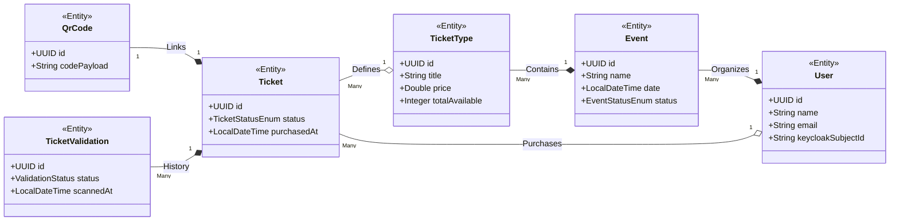

<div align="center">
  
  # TicketForge: Event Ticket Platform
  
  [](https://openjdk.org/)
  [](https://spring.io/projects/spring-boot)
  [](https://www.keycloak.org/)
  [](https://www.postgresql.org/)
  [](https://www.docker.com/)

  **A secure, high-performance backend platform for managing event lifecycles and ticket distribution.**

</div>

---

## 📖 Table of Contents

- [🚀 Overview](#-overview)
- [✨ Key Features](#-key-features)
- [🛠 Tech Stack](#-tech-stack)
- [🚦 Getting Started](#-getting-started)
- [🏗 System Architecture](#-system-architecture)
- [🔄 User & Interaction flows](#-user--interaction-flows)
- [📊 Data Model](#-data-model)
- [ Security Architecture](#-security-architecture)
- [🔌 API Reference](#-api-reference)
- [❓ FAQ & Interview Questions](#-faq--interview-questions)

---

## 🚀 Overview

**TicketForge** is a robust Spring Boot backend designed to handle the complexities of event management and seat reservation. Whether you are an **Organizer** creating large-scale festivals or a **Staff Member** validating tickets at the venue, TicketForge provides a seamless, secure, and atomic experience.

### Why TicketForge?
- **High Concurrency**: Uses pessimistic locking to ensure tickets are never oversold.
- **Enterprise Security**: Integrated with Keycloak for robust JWT-based OIDC authentication.
- **Developer Friendly**: Clean architecture, automated DTO mapping with MapStruct, and comprehensive API documentation.

---

## ✨ Key Features

- **📅 Event Lifecycle Management**: Complete control for organizers to create, publish, and manage events.
- **🔍 Intelligent Discovery**: Public API for searching and filtering published events with PostgreSQL full-text search.
- **�️ Atomic Ticket Purchase**: High-integrity ticketing system with pessimistic locking to prevent overselling.
- **🖼️ QR Code Integration**: Automatic generation and retrieval of QR codes for secure venue entry.
- **✅ Multi-mode Validation**: Support for both manual ID entry and high-speed QR code scanning.
- **🔐 Enterprise Security**: Integrated user provisioning and JWT validation via Keycloak.

---

## 🛠 Tech Stack

### 🚀 Core Backend
- **Java 21**: Leveraging the latest LTS features.
- **Spring Boot 4.0.2**: The foundation of our micro-framework.
- **Spring Data JPA**: Efficient database access with Hibernate.
- **PostgreSQL**: Reliable relational data storage.

### 🛡 Security & Auth
- **Spring Security**: Robust resource server configuration.
- **Keycloak**: Leading open-source Identity and Access Management.
- **OAuth2 / JWT**: Standardized token-based authentication.

### 🧰 Utilities & Tools
- **MapStruct**: High-performance, type-safe bean mapping.
- **Lombok**: Reduced boilerplate for cleaner code.
- **ZXing**: Trusted library for barcode and QR code processing.
- **Docker**: Containerized environment for Postgres, Adminer, and Keycloak.

---

## 🚦 Getting Started

### 📋 Prerequisites
- **Java 21** (OpenJDK recommended)
- **Docker & Docker Compose**
- **Maven** (or used bundled `./mvnw`)

### 🛠️ Setup Steps

1. **Clone & Compile**:
   ```bash
   ./mvnw -DskipTests clean compile
   ```

2. **Launch Dependencies**:
   ```bash
   docker compose up -d
   ```
   *Starts Postgres (5432), Adminer (8888), and Keycloak (9090).*

3. **Configure Keycloak**:
   - Create realm: `event-ticket-platform`
   - Create roles: `ROLE_ORGANIZER`, `ROLE_STAFF`
   - Ensure tokens include `sub`, `preferred_username`, and `email`.

4. **Run Application**:
   ```bash
   ./mvnw spring-boot:run
   ```
   *Access the API at `http://localhost:8080`*

### 🔍 Troubleshooting

- **Database Connection Error**: Ensure docker containers are healthy. Run `docker ps` to verify.
- **Unauthorized (401)**: Check if the JWT has expired or if the `issuer-uri` in `application.properties` matches your Keycloak setup.
- **Empty Authorities**: Ensure your Keycloak roles have the `ROLE_` prefix.

---

## 🏗 System Architecture

### 🌐 High-Level Flow
The system follows a modern Resource Server architecture where Keycloak acts as the central Identity Provider.

```mermaid
flowchart LR
    style C fill:#2a9d8f,stroke:#264653,stroke-width:2px,color:#fff
    style K fill:#e76f51,stroke:#264653,stroke-width:2px,color:#fff
    style A fill:#e9c46a,stroke:#264653,stroke-width:2px,color:#000
    style D fill:#f4a261,stroke:#264653,stroke-width:2px,color:#000

    C[📱 Client Apps<br/>Web / Mobile / Scanner]
    K[🔐 Keycloak<br/>OIDC Provider]
    A[⚙️ TicketForge API<br/>Spring Boot]
    D[(🗄️ PostgreSQL)]

    C -->|1. Login / Token Request| K
    K -.->|2. Issue JWT Access Token| C
    C -->|3. API Call + Bearer JWT| A
    A -->|4. Validate Signature & Issuer| K
    A <-->|5. Read/Write Entities| D
```



---

## 🔄 User & Interaction flows

### 🎟️ Purchase & Validation Sequence
This diagram illustrates the critical path from ticket purchase to venue validation, highlighting the pessimistic locking mechanism.

```mermaid
sequenceDiagram
    autonumber
    
    actor U as 👤 User Client
    participant API as 🌐 TicketForge API
    participant DB as 🗄️ PostgreSQL
    participant QR as 🖼️ QR Service
    actor S as 🎫 Staff Scanner

    rect rgb(230, 245, 255)
    Note over U,QR: Phase 1: High-Concurrency Ticket Purchase
    
    U->>API: POST /tickets (EventId, TicketTypeId)
    API->>DB: Query User & Event Data
    Note over API,DB: Begin @Transactional
    API->>DB: PESSIMISTIC_WRITE Lock on TicketType
    API->>DB: Check Inventory (countByTicketTypeId)
    
    alt Tickets Sold Out
        API-->>U: 400 TicketsSoldOutException
    else Tickets Available
        API->>DB: Save(Ticket: PURCHASED)
        API->>QR: Generate Unique QR UUID
        QR-->>DB: Link QR to Ticket
        API-->>U: 201 Created (Success)
    end
    Note over API,DB: Commit & Release Lock
    end

    rect rgb(240, 255, 240)
    Note over S,DB: Phase 2: Venue Validation
    
    S->>API: POST /ticket-validations {QR_CODE_DATA}
    API->>DB: Lookup Ticket & Check Validation History
    
    alt Already Validated
        API-->>S: 403 Forbidden (Ticket Already Used)
    else Valid & Unused
        API->>DB: Save(Validation: SUCCESS)
        API-->>S: 200 OK (Entry Granted)
    end
    end
```



### 📅 Management & Discovery Flow
Detailed steps for organizers managing events and users discovering them asynchronously.


---

## 📊 Data Model

### 🧩 Class Structure
Core domain entities mapped strictly one-to-one to the underlying database tables.



### 🗄️ Entity Relationship Diagram (ERD)


---

## 🛡 Security Architecture

TicketForge implements a high-security posture as an **OAuth2 Resource Server**. It offloads identity management to Keycloak, ensuring industry-standard protection.

### 1. 🔐 Authentication Flow
- **Standard**: OIDC / JWT
- **Issuer**: Configured via `spring.security.oauth2.resourceserver.jwt.issuer-uri`
- **Validation**: Automatic signature and issuer verification against Keycloak's JWKS.

### 2. 🎭 Role-Based Access Control (RBAC)
We use a custom `JwtAuthenticationConverter` to map Keycloak roles to Spring Security authorities.
> [!IMPORTANT]
> Roles in Keycloak must be prefixed with `ROLE_` (e.g., `ROLE_ORGANIZER`) to be recognized by the default converter setup.

### 3. 👤 Seamless User Provisioning
The `UserProvisioningFilter` automatically synchronizes Keycloak users with the local PostgreSQL database on their first successful request, using the `sub` claim as a persistent identifier.

---

## 🔌 API Reference

### 📅 Event Management (`/api/v1/events`)
| Method | Endpoint | Access | Action |
|:---:|:---|:---:|:---|
| `POST` | `/events` | `ORGANIZER` | Initialize a new event |
| `PUT` | `/events/{id}` | `Auth` | Update event parameters |
| `GET` | `/events` | `ORGANIZER` | List all organized events |
| `DELETE` | `/events/{id}` | `Auth` | Remove event from platform |

### 🌍 Discovery (`/api/v1/published-events`)
| Method | Endpoint | Access | Action |
|:---:|:---|:---:|:---|
| `GET` | `/published-events` | `Public` | Search & list active events |
| `GET` | `/published-events/{id}`| `Public` | View event microsite |

### 🎟️ Ticketing & Validation
| Method | Endpoint | Access | Action |
|:---:|:---|:---:|:---|
| `POST` | `/api/v1/events/.../tickets` | `Auth` | Atomic ticket purchase |
| `GET` | `/tickets` | `Auth` | View personal ticket wallet |
| `GET` | `/tickets/{id}/qr-codes` | `Auth` | Download entry QR code |
| `POST` | `/ticket-validations` | `STAFF` | Validate ticket at gate |

> [!TIP]
> All errors follow a consistent JSON shape: `{"error": "Description"}`

---

## ❓ FAQ & Interview Questions

### 🏗 Architecture & System Design

<details>
<summary><b>1. Why use PESSIMISTIC_WRITE lock for ticket purchase?</b></summary>
We utilize a <code>PESSIMISTIC_WRITE</code> lock to ensure absolute data integrity during the critical ticket purchasing phase, especially under high-concurrency event drops. When a user attempts to buy a ticket, the database immediately locks the specific <code>TicketType</code> row, preventing any other transaction from reading or modifying the available ticket count until the current transaction commits or rolls back. This strong isolation guarantees that we never oversell tickets beyond the defined capacity. While it introduces some latency compared to optimistic locking, the trade-off is necessary to prevent severe business impact and customer dissatisfaction caused by double-booking highly sought-after seats.
</details>

<details>
<summary><b>2. How would you handle high-scale ticketing bursts (e.g., concert drops)?</b></summary>
To handle extreme traffic spikes, we would transition from synchronous database locks to an asynchronous, queue-based architecture. A high-performance in-memory datastore like Redis would act as a virtual waiting room, accepting initial requests and managing atomic counters for available inventory in real-time. Accepted requests would then be published to a message broker (like RabbitMQ or Kafka) where background worker nodes process the actual database writes and payments asynchronously. Clients would poll a status endpoint or receive Server-Sent Events (SSE) to get their finalized ticket confirmation, protecting the core database from being overwhelmed.
</details>

<details>
<summary><b>3. Why is this app a Resource Server, not an Auth Server?</b></summary>
TicketForge is designed as a pure microservice focused exclusively on the core business logic of event and ticket management. By acting strictly as an OAuth2 Resource Server, it delegates the complex responsibilities of identity management, user authentication, and token issuance to Keycloak, a dedicated and hardened Identity Provider (IdP). This architectural decision significantly reduces our application's attack surface and maintenance burden while ensuring we meet industry-standard security compliance. It also allows us to easily support federated logins (e.g., Google, GitHub) in the future without modifying the core backend code.
</details>

<details>
<summary><b>4. How does the system ensure idempotent ticket processing?</b></summary>
Idempotency ensures that if a client retries a purchase request due to a network timeout, they aren't charged twice and two tickets aren't issued. We can achieve this by requiring the client to pass a unique <code>Idempotency-Key</code> header with every POST request to the ticketing endpoint. The backend checks if this key already exists in a distributed cache (like Redis) or a dedicated database table. If a previous transaction with that exact key succeeded, the server simply returns the cached success response rather than processing the transaction again, guaranteeing safe retries across distributed components.
</details>

<details>
<summary><b>5. How do you manage database schema evolution?</b></summary>
Database schemas evolve as the application grows, and we manage these changes using version control tools like Flyway or Liquibase. Instead of manually executing SQL scripts, we commit immutable migration files (e.g., <code>V1__init_schema.sql</code>, <code>V2__add_status_index.sql</code>) alongside our application code. When Spring Boot starts up, the migration tool automatically inspects the database's schema history table and applies any pending migrations sequentially. This ensures that every developer, staging server, and production environment runs against the exact same, predictable database structure without manual intervention.
</details>

### 🔐 Security & Identity Providers

<details>
<summary><b>6. What is the purpose of the UserProvisioningFilter?</b></summary>
The <code>UserProvisioningFilter</code> acts as an interceptor for authenticated requests to ensure our local database stays synchronized with the Keycloak Identity Provider. Since Keycloak handles the actual user registration and authentication, our backend might receive a valid JWT for a user who doesn't yet exist in our PostgreSQL <code>users</code> table. This filter extracts the <code>sub</code> (subject), email, and name claims from the incoming token and seamlessly creates a local user record if one is missing. This process guarantees that we can safely establish foreign key relationships between the user and their purchased tickets within our domain.
</details>

<details>
<summary><b>7. How do you extract and map Keycloak custom roles in Spring Security?</b></summary>
Keycloak embeds custom roles inside a specific nested JSON structure within the JWT claims, typically under <code>realm_access.roles</code>. Because Spring Security defaults to looking for roles in a flat <code>scope</code> or <code>scp</code> claim, we implement a custom <code>Converter&lt;Jwt, AbstractAuthenticationToken&gt;</code>. This converter intercepts the incoming JWT, navigates to the Keycloak-specific claims path, extracts the role lists, applies the required <code>ROLE_</code> prefix, and maps them to standard Spring Security <code>GrantedAuthority</code> objects, enabling <code>@PreAuthorize</code> annotations to function correctly across our controllers.
</details>

<details>
<summary><b>8. How do you protect against Cross-Site Request Forgery (CSRF)?</b></summary>
Because TicketForge operates as a stateless backend serving modern Single Page Applications (SPAs) or mobile clients using OAuth2 Bearer Tokens (JWTs), CSRF protection is generally completely disabled (<code>csrf.disable()</code>) in the Spring Security configuration. CSRF attacks rely on the browser automatically attaching session cookies to cross-origin requests. Since our authentication mechanism relies entirely on the client manually attaching the JWT in the <code>Authorization: Bearer</code> header—which browsers do not do automatically for cross-site requests—the standard CSRF attack vector is effectively neutralized by design.
</details>

<details>
<summary><b>9. How are JWTs validated locally without contacting Keycloak on every request?</b></summary>
When Spring Boot operates as an OAuth2 Resource Server, it performs localized, asymmetrical JWT validation to maximize performance. Upon startup, the application fetches Keycloak's public keys via a designated JSON Web Key Set (JWKS) endpoint. For every incoming API request, Spring Security uses these cached public keys to cryptographically verify the JWT's signature, guaranteeing it was legitimately signed by Keycloak's private key. The framework also automatically checks the token's expiration (<code>exp</code>) and issuer (<code>iss</code>) claims locally, ensuring zero network overhead to the authorization server on the critical path.
</details>

### 🎟 Core Ticketing & Data Integrity

<details>
<summary><b>10. How does QR-based validation enforce single entry?</b></summary>
The system guarantees single entry by maintaining a strict, append-only validation history in the database. When a staff member scans a ticket's QR code, the system queries the <code>TicketValidationRepository</code> to check if a <code>VALID</code> entry already exists for that specific ticket ID. If a prior successful scan is found, the current scan is immediately rejected and recorded as an unauthorized attempt. This mechanism prevents users from sharing screenshots of their QR codes or attempting to enter the venue multiple times with the same digital ticket, ensuring a secure access control flow.
</details>

<details>
<summary><b>11. How do you ensure the security of the QR codes?</b></summary>
The QR codes generated by the platform embed a highly secure, non-sequential UUID (Universally Unique Identifier) linked directly to the ticket record. Unlike sequential integer IDs, UUIDs are cryptographically robust and practically impossible to guess, preventing attackers from generating valid payloads through brute force. Furthermore, the QR code payload itself does not contain any sensitive user information, acting only as an anonymous reference key. True validation happens securely on the backend when the staff scanner application sends the scanned code to the authenticated <code>/ticket-validations</code> endpoint, where real-time status checks are performed.
</details>

<details>
<summary><b>12. Why do you use UUIDs over auto-incrementing Integers for primary keys?</b></summary>
UUIDs are highly preferred in distributed microservice architectures for several critical security and scaling reasons. Firstly, they prevent enumeration attacks; if endpoints relied on numeric IDs like <code>/api/tickets/5</code>, an attacker could easily guess that ticket <code>6</code> exists and attempt to scrape it. UUIDs obscure the overall size and velocity of ticket sales from competitors. Additionally, UUIDs generated strictly as <code>UUIDv4</code> significantly simplify database merging across offline environments and eliminate sequences bottlenecks when executing massive parallel inserts.
</details>

<details>
<summary><b>13. How do you handle transaction rollbacks if generating the QR code fails?</b></summary>
The ticket purchase flow is strictly wrapped inside a Spring <code>@Transactional</code> boundary. When a user requests a ticket, the framework initializes a database transaction. We lock the row, verify inventory, debit the count, and save the <code>Ticket</code> entity. If the subsequent external call to generate and link the QR code throws an unhandled `RuntimeException` (e.g., an OutOfMemoryError or library failure), Spring’s proxy interceptor detects the exception and issues an automatic rollback constraint to PostgreSQL. All previous database state changes are immediately reverted, ensuring we don't end up with heavily corrupted data, such as a debited ticket type without an assignable QR code.
</details>

### Java, Spring Boot & Optimization

<details>
<summary><b>14. Why use MapStruct instead of manual mapping?</b></summary>
MapStruct provides a highly efficient, annotation-based approach to mapping between our Entities and Data Transfer Objects (DTOs) at compile time. Unlike reflection-based mappers (like ModelMapper), MapStruct generates plain Java method invocations, ensuring maximum runtime performance and type safety. This eliminates the tedious and error-prone boilerplate associated with manual mapping methods while still allowing for custom mapping logic where complex transformations are required. Consequently, the codebase remains clean, maintainable, and highly optimized for our strict latency requirements.
</details>

<details>
<summary><b>15. Why avoid using `@Autowired` on private instance variables?</b></summary>
Field injection via <code>@Autowired</code> on private variables is considered an anti-pattern in modern Spring applications because it tightly couples the class to the Spring Container and makes unit testing incredibly difficult without reflection hacks. Instead, we use constructor injection, often facilitated by Lombok's <code>@RequiredArgsConstructor</code> over <code>private final</code> fields. Constructor injection ensures that the bean cannot be instantiated without all its required dependencies, heavily promoting immutability and allowing us to easily instantiate the class with mock objects during isolated unit testing.
</details>

<details>
<summary><b>16. How do you handle centralized exception management?</b></summary>
We handle exceptional states exclusively through a generic, centralized <code>@RestControllerAdvice</code> class. This component intercepts specific customized exceptions—such as <code>TicketsSoldOutException</code> or <code>ResourceNotFoundException</code>—thrown anywhere within the deeper service layers. The advice class then transforms these Java exceptions into standardized, heavily-structured JSON payloads containing timestamp, status code, detailed message, and diagnostic trace IDs, alongside the appropriate HTTP semantic response code (e.g., mapping a missing ticket search to a strict <code>404 Not Found</code>). This guarantees consistency for frontend consumability.
</details>

<details>
<summary><b>17. Explain your strategy for database indexing in this application.</b></summary>
When constructing our PostgreSQL schema, we prioritize indexing strategic columns heavily involved in filtering, sorting, and joins. Since foreign keys do not inherently create indexes in Postgres, we manually apply indexes to fields like <code>user_id</code> on the tickets table and <code>event_id</code> on the ticket types table to prevent devastating full-table scans during relational joins. Additionally, for endpoints displaying published event lists to users, we add specialized index types (like B-Tree on the <code>status</code> and timestamp columns) to drastically improve pagination and conditional where-clause performance on the primary read-path.
</details>

<details>
<summary><b>18. What is the N+1 select problem and how do you prevent it in JPA?</b></summary>
The N+1 select problem occurs when an ORM framework issues one initial query to fetch a list of parent entities (e.g., 10 Events), and then executes an additional query for each individual parent to fetch its lazily-loaded children (e.g., getting the 10 TicketTypes for those events), resulting in 11 queries instead of 1. To resolve this severe performance bottleneck, we explicitly declare <code>@EntityGraph</code> annotations or use custom JPQL queries with <code>JOIN FETCH</code> clauses in our Spring Data Repositories. This forces Hibernate to eagerly retrieve both the parent and child entities in a single, highly optimized SQL join statement.
</details>

<details>
<summary><b>19. Why should an Entity never be returned directly from a REST controller?</b></summary>
Returning JPA Entities directly from REST controllers leaks internal database schema design to the client, strongly violating separation of concerns. This tight coupling means any minor database refactoring could inadvertently break connected mobile or web apps. Furthermore, exposing entities often unintentionally serializes highly sensitive, hidden fields (like encrypted password hashes or internal audit columns) straight to the public internet. We exclusively bind JSON serialization to explicit Data Transfer Objects (DTOs), guaranteeing we are transmitting the absolute minimum subset of required data and controlling exact serialization logic.
</details>

<details>
<summary><b>20. What is the difference between `@Transactional(readOnly = true)` and regular `@Transactional`?</b></summary>
Applying <code>readOnly = true</code> to a standard Spring <code>@Transactional</code> annotation provides distinct optimization edges when a service method only executes <code>SELECT</code> statements. Hibernate skips creating deep hydration snapshots of retrieved entities because it knows it won't ever need to perform dirty checking for flush updates. Furthermore, Spring routes these specific read-only transactions to database driver optimizations, potentially routing the heavy read traffic away from the primary writer node to read-replica database nodes in a highly distributed clustered environment, boosting the overall read throughput.
</details>

---

<div align="center">
  <sub>Built with ❤️ by the TicketForge Team</sub>
</div>
